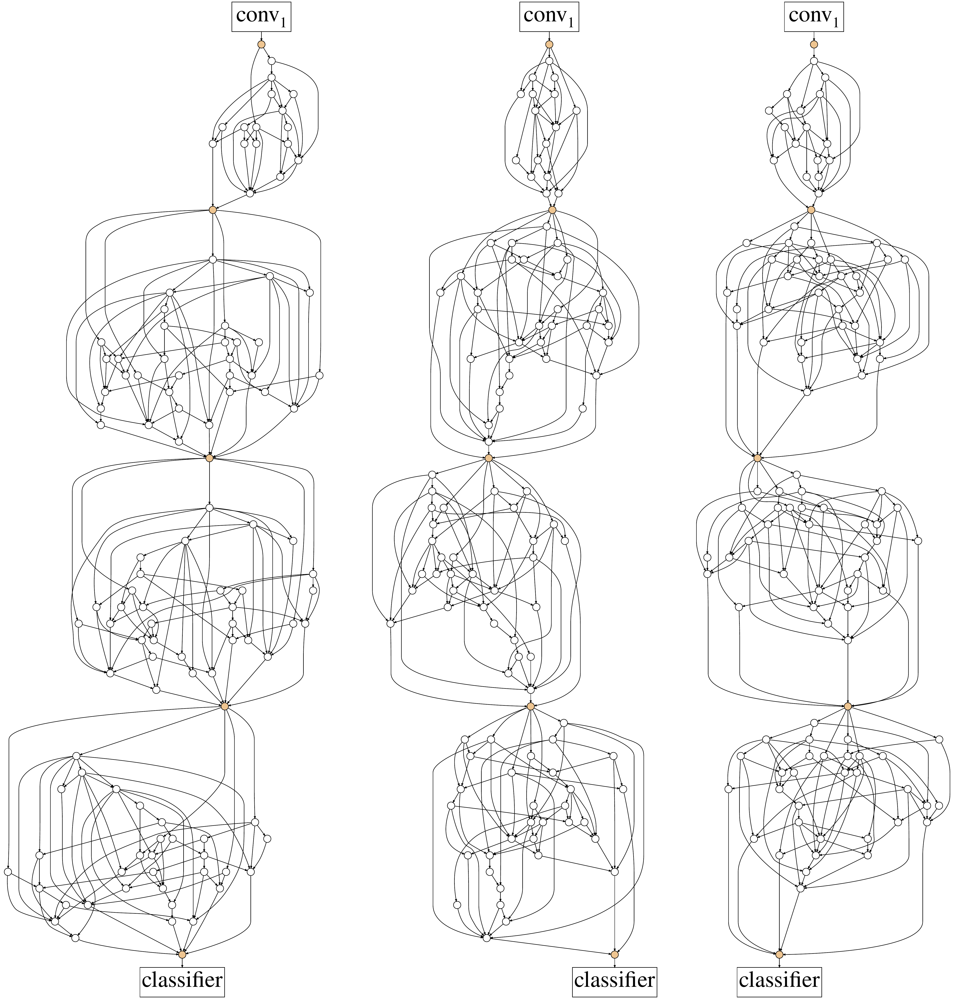

# RandlyWiredNN

[](https://paperswithcode.com/sota/image-classification-imagenet-image-reco?p=exploring-randomly-wired-neural-networks-for)

This is an Unofficial implementation of: [Randomly Wired Neural Network](https://arxiv.org/abs/1904.01569)(In Progress).


### Project Overview

In this project, I am going to implement one of the image classification model generated using one of the state-of-the-art NAS method.

##### NAS (Computer Vision)

NAS, Neural Architecture Search, is essentilly an algorithm that allows auomatic buildilng of a neural network model given parameters. Unlike hand-designed NN architectures such as [DenseNet](https://arxiv.org/pdf/1608.06993.pdf), [ResNet](https://arxiv.org/pdf/1512.03385.pdf), etc., an NAS lets the heuristics design how to information is processed and the model will learn the representations of image.

##### Randomly Wired NN

In the paper [Randomly Wired Neural Network](https://arxiv.org/abs/1904.01569), it is proposed that NAS is meant for the architecture to be built freely with lack of human bias. However, existing NAS methods have limited the search methods and this paper attempts to let the architecture be build more freely using graph algorithms.

##### Datasets (ordered by magnitude)

- [PatchCamelyon](https://patchcamelyon.grand-challenge.org)
- [VOC 2012](http://host.robots.ox.ac.uk/pascal/VOC/voc2012/)
- [ImageNET](https://www.image-net.org)

As the datasets are ordered by magnitude, they will be trained sequentially and if the classification accuracy reaches a threshhold then I will move on the next largest dataset.

### Objective

The objective of this project is for me to gain better understanding of the NAS in general and in the state-of-the-art techniques of NAS. As the project progresss, I plan to adapt the Randomly Wired Neural Network model to object detection as well.

### Tasks

- [x] Base NN architecture from which the Network Generator will build the model
- [x] Graph algorithm for the Network Generator
  - [x] Erdo ̋s-Re ́nyi (ER)
  - [x] Baraba ́si-Albert (BA)
  - [x] Watts-Strogatz (WS)
- [ ] Network Generator (On-Going)
- [x] Dataset pipelines
- [x] Training Functions
- [ ] Testing Functions
- [ ] Script to train the model

### Requirements

- Such libraries are necessary to run the program.
  ```
  torch >= 1.9.0
  torchvision >= 0.10.1
  networkx >= 2.6.3
  ```
